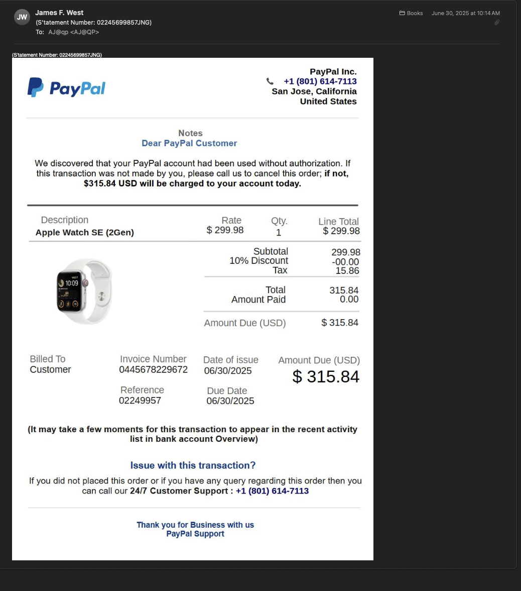

# 📧 Phishing Email Investigation – Project 01

## 🕵️ Overview

This case analyzes a suspicious email that contained **no text body** and only a **PNG image attachment** — a screenshot of a fake email. Using a mix of open-source tools and manual inspection, I investigated the source, identified IOCs, and enriched them to understand the intent and infrastructure behind the message.

---

## 🔧 Tools & Sources Used

- **MXToolbox** — Email header visualization
- **AbuseIPDB** — IP reputation check
- **IPinfo.io** — IP geolocation and privacy data
- **GreyNoise** — Checks for internet-wide scanning behavior
- **macOS Terminal** — `grep` for metadata & IOC extraction

---

## 🧪 Steps Taken

1. **Header Analysis**
   - Raw headers saved to: [`email01_header_analysis.txt`](./email01_header.txt)
   - MXToolbox results screenshot: [`screenshots/mxtoolbox-header.png`](./screenshots/mxtoolbox-header.png)

----
2. **IOC Extraction**
   - IOC list: IP, email address, phone number, attachment
   - Extraction method: Terminal `grep` commands  
   - Commands stored in: [`playbook-commands.md`](./playbook-commands.md)

3. **IOC Enrichment**
   - IP address `57.103.77.23` enriched using:
     - [AbuseIPDB](https://www.abuseipdb.com/check/57.103.77.23)
     - [IPinfo.io](https://ipinfo.io/57.103.77.23)
     - [GreyNoise](https://viz.greynoise.io/ip/57.103.77.23)
     -    - Phone number `+1 (801) 614-7113` enriched using:
     - [Robokiller Lookup](https://lookup.robokiller.com/)
     - Google search & scam databases
   - Results and screenshot in: [`ioc-enrichment.md`](./ioc-enrichment.md)

4. **Analysis Notes**
   -  Screenshot of phishing email: [`screenshots/phishing-email-01-screenshot.png`](./screenshots/phishing-email-01-screenshot.png)
   - Full analysis and observations: [`analysis-notes.md`](./analysis-notes.md)

---

## 🔍 Key Findings

- ✅ **Sender not spoofed** — Passed SPF, DKIM, and DMARC
- 🛡️ **IP address** (`57.103.77.23`) is Apple infrastructure (AS714)
- 🧊 Likely abuse of iCloud Mail to mask attacker identity
- 🧷 No clickable links — only an image with a **US-based phone number**
- 🎯 Likely a **bait tactic** to confirm active email address before launching full campaign

---

## 📚 What I Learned

- Spoofing isn't always needed — **real email services can be abused**
- MXToolbox helps, but **manual parsing reveals deeper details**
- IOC enrichment must be **safe** — never upload sensitive samples
- Even a quiet phishing email can reveal **intent, sender infra, and techniques**

---

