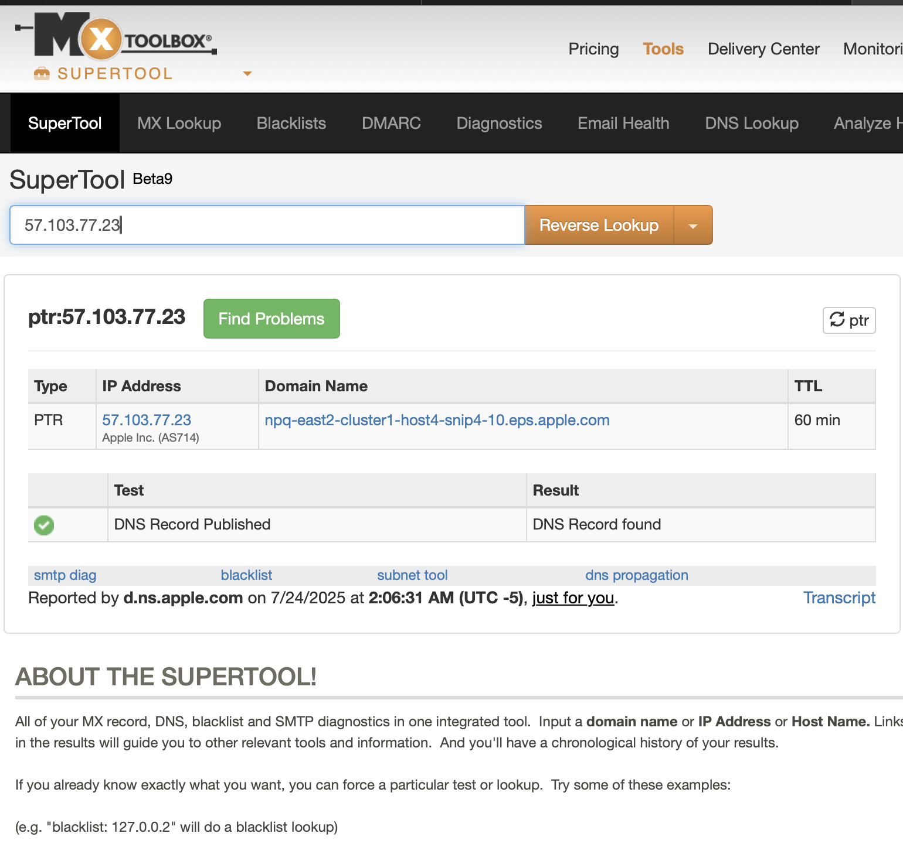
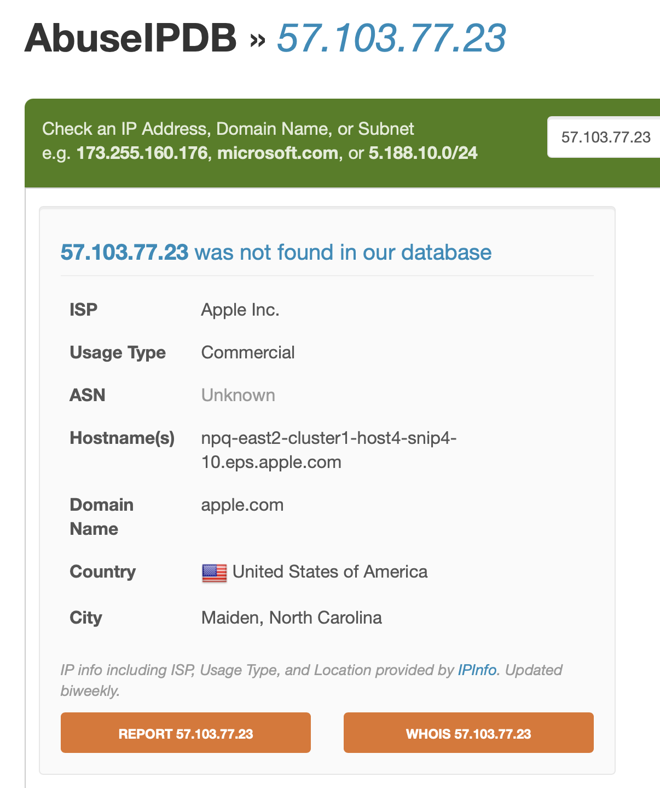
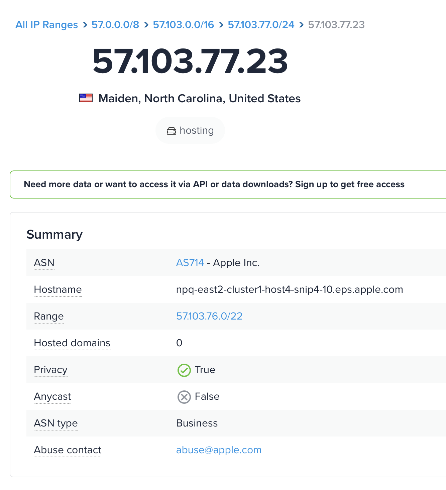
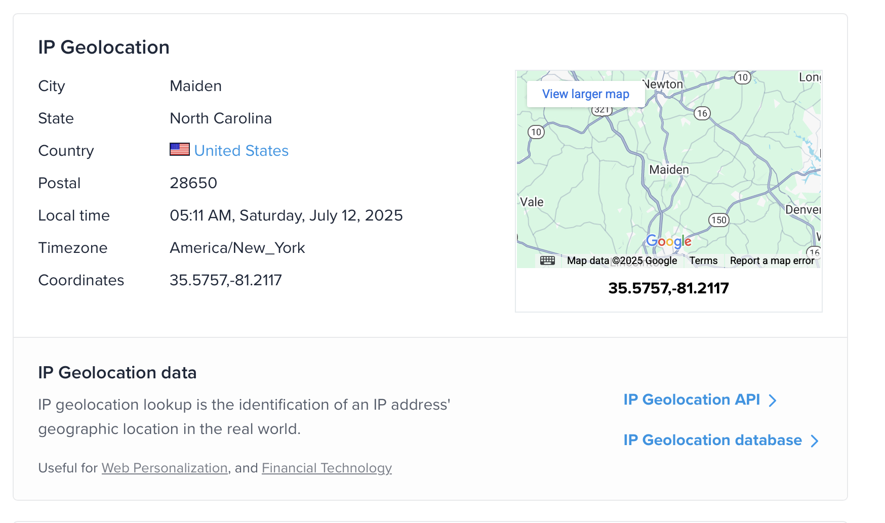
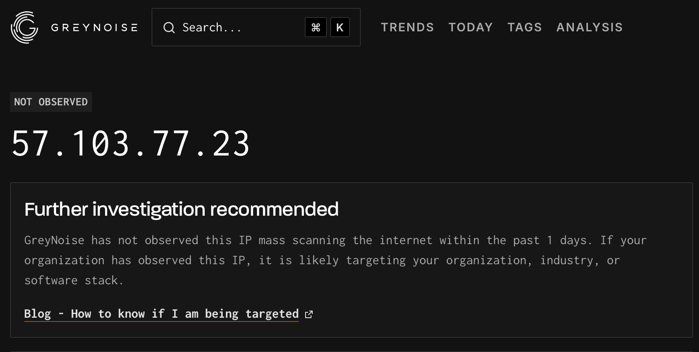
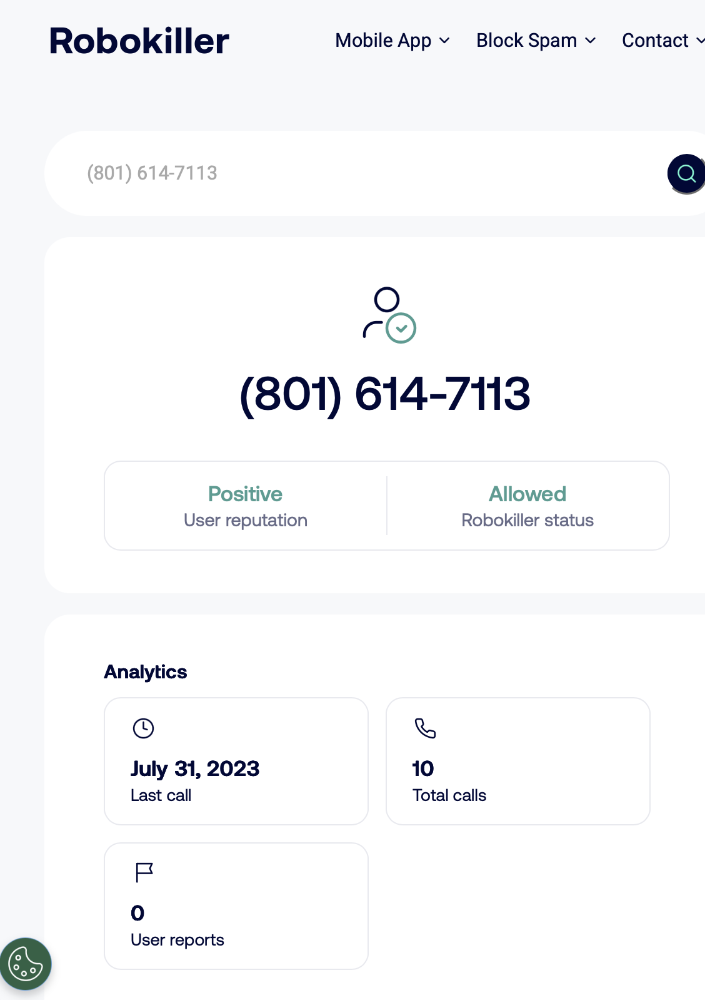

# 📂 IOC Enrichment – Project 01: Email Header Investigation

This file documents the enrichment results for the IP address extracted from the suspicious email analyzed in `email01_header_analysis.txt`.

---

## 🔍 Enriched IOC: IP Address `57.103.77.23`

### ✅ Summary Table

| Source        | Key Findings |
|---------------|--------------|
| **AbuseIPDB** | ❌ Not found in database. No abuse reports for this IP. |
| **IPinfo.io** | ✅ IP belongs to Apple Inc. Hostname: `npq-east2-cluster1-host4-snip4-10.eps.apple.com`. Geolocated in Maiden, NC. Privacy: `true` (sender masked). |
| **GreyNoise** | ⚠️ Not scanning internet recently → may indicate **targeted** delivery. |
| **MXToolbox** | ✅ Reverse DNS lookup shows Apple hostname. No blacklists triggered. TTL: 60 min. |

---

## 🖼️ Enrichment Screenshots

### 📸 MXToolbox Results

- Reverse DNS: `npq-east2-cluster1-host4-snip4-10.eps.apple.com`
- No blacklists detected  
- TTL: 60 minutes

**Image:**  

---

### 📸 AbuseIPDB

- IP: `57.103.77.23`
- ISP: Apple Inc.
- Status: Not listed  
- No reports of abuse

**Image:**  

---

### 📸 IPinfo.io

- ASN: AS714 — Apple Inc.
- Hostname: `npq-east2-cluster1-host4-snip4-10.eps.apple.com`
- Location: Maiden, NC, USA
- Abuse Contact: `abuse@apple.com`
- Privacy: True (Apple masks actual sender)

**Image:**  

---

### 📸 GreyNoise

- No recent scanning activity
- Likely a **targeted message** to this recipient

**Image:**  

---

## 🧠 Interpretation

- This IP belongs to **Apple’s iCloud Mail infrastructure**.
- The email was **not spoofed** — the attacker used a real iCloud account.
- This tactic allows the attacker to **pass SPF, DKIM, and DMARC** checks, gaining legitimacy.
- **Abuse** is tied to the account behavior, not the IP itself.

---

## 💡 Tactic Observed

**Phishing method:**  
Attackers are increasingly using real email providers (e.g., iCloud, Gmail) to evade filters and build trust. Messages sent from these providers often **pass all security checks**, making them harder to detect without content or behavioral analysis.

---

---

## 🔍 Enriched IOC: Phone Number `+1 (801) 614-7113`

This number appeared inside the **phishing image attachment** and may be part of the attacker’s contact infrastructure. Below are the enrichment results from public OSINT tools and lookup services:

### ✅ Summary of Results

| Tool / Source         | Result |
|-----------------------|--------|
| **Google Search**     | ❌ No results or scam reports found |
| **Robokiller Lookup** | ✅ Found  
• Last activity: July 31, 2023  
• Total calls: 10  
• Reports: 0 |
| **ScamNumbers.info**  | ❌ No match found |

---

### 🖼️ Screenshot

Robokiller Lookup Results:  

---

### 🧠 Interpretation

- This phone number has **low visibility across public scam databases**.
- Robokiller confirms **past call activity**, but no abuse reports — this suggests it may be part of a **newer campaign** or used in **low-volume phishing**.
- No link to identity or carrier could be found via public tools.
- Appearing inside an **image-only phishing email**, this number may serve to **confirm active recipients** or bait responses (e.g., tech support scam, fake invoice inquiry).

---

### 💡 Tactic Observed

**Silent recon tactic:** Embed a phone number in an image to:
- Evade automated scanners  
- Track email opens (image loads)  
- Solicit direct human contact via call/text

---

